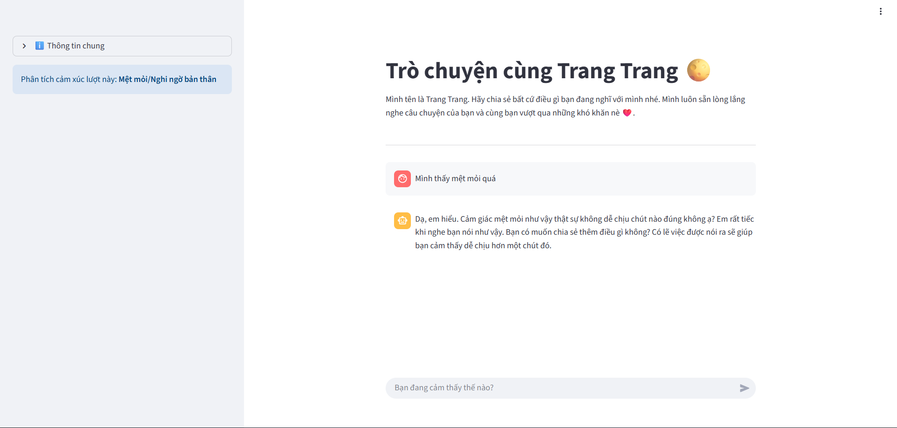

<p align="center">
  
  
  
  
  
  
  
</p>


<div align="center">
  
  # CHATBOT TÂM SỰ VÀ PHÁT HIỆN CÁC VẤN ĐỀ TÂM LÝ
  
</div>

## Giới thiệu 🌕
- Đây là source code mẫu để xây dựng và phát triển một chatbot AI dùng để tâm sự với người dùng và phát hiện xem họ có vấn đề tâm lý không. Chatbot sử dụng kết hợp Mô hình Xử lý Ngôn ngữ Tự nhiên (NLP) và các Mô hình ngôn ngữ lớn (LLM) như GPT, Gemini, LLama,... để xây dựng nên hệ thống chatbot.
- Nếu bạn thấy source code này có ích hay liên quan đến đề tài nghiên cứu của bạn, hãy thoải mái sử dụng nó. 

---


---
## Công nghệ sử dụng 🧑‍💻
- Môi trường: WSL2/Ubuntu24.04
- Model phân tích, dự đoán cảm xúc: PhoBERT (sử dụng thư viện PyTorch)
- AI assistant dùng để giao tiếp với người dùng: Gemini 1.5 Flash
- Giao diện chatbot: Streamlit
---
## Thiết lập môi trường ⚙️
- Môi trường: Vì project này cần train mô hình NLP nên sẽ cần đến GPU. Bạn có thể train model với colab. Ở project này mình thực hiện train local với WSL2.
- Nếu bạn chạy local với linux thì hãy thực hiện các lệnh sau để xây dựng chatbot:
```
git clone https://github.com/HocVoNgThai/Vietnamese-Stress-Detector-Chatbot.git
cd Vietnamese-Stress-Detector-Chatbot
bash setup.sh
cd ..
cd Chatbot
nano .env # Thay API key của bạn
streamlit run app.py
```
- Truy cập `http://localhost:8501` để mở giao diện chat.
---
## Bộ dữ liệu 📅
- Toàn bộ dữ liệu trong project được gen 100% bằng AI. Bạn có thể tự tạo prompt và tạo thêm các mẫu để mở rộng bộ dữ liệu. Prompt mẫu tham khảo có trong file [genData](https://github.com/HocVoNgThai/Vietnamese-Stress-Detector-Chatbot/blob/main/Datasets/genData.py).

---
## Đề xuất hướng phát triển 🚀
- Sàng lọc và mở rộng bộ dữ liệu để tăng độ tin cậy.
- Test với các mô hình NLP khác để xác định mô hình phù hợp nhất với ngữ cảnh bài toán.
- Xây dựng giao diện web hoàn thiện hơn và deploy thực tế.
- Tạo DB lưu trữ dữ liệu chat của người dùng để phát triển hệ thống.
- Mở rộng thêm tính năng chat bằng giọng nói và phân tích cảm xúc qua audio.

---
## License 🔐
© 2025 HocVoNgThai. All rights reserved.
